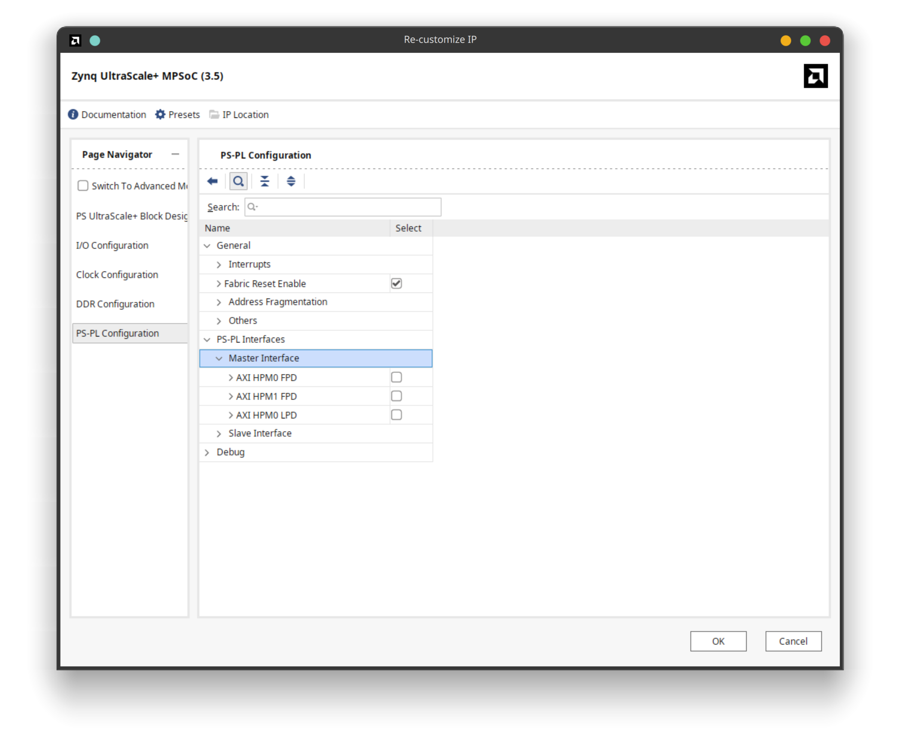
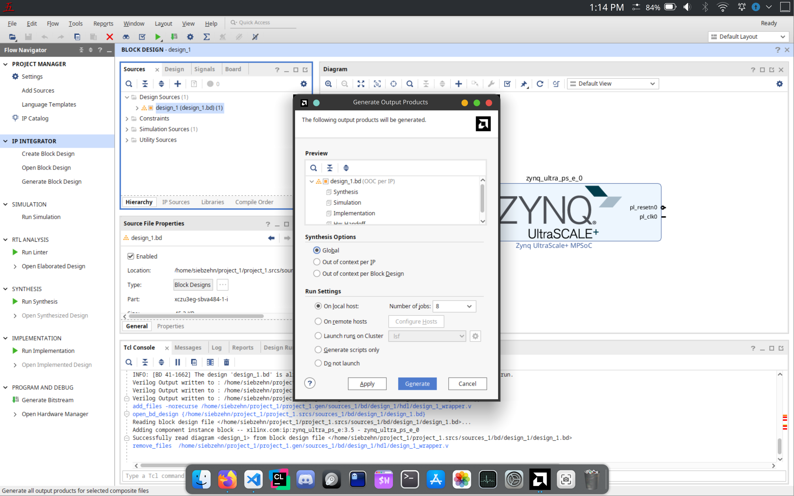
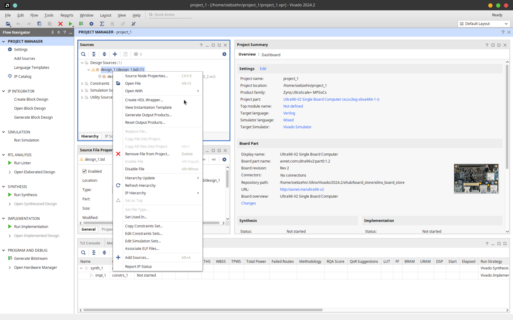
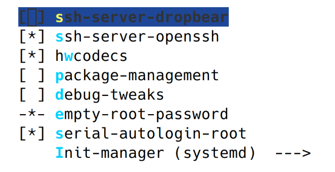
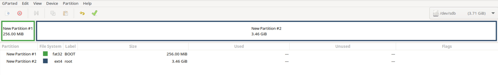
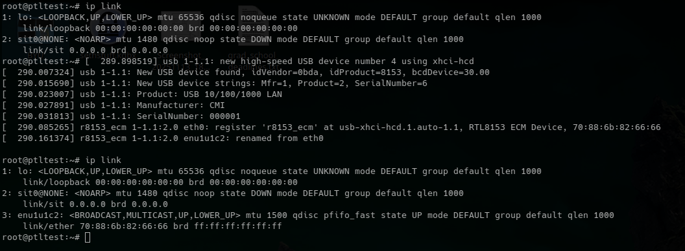
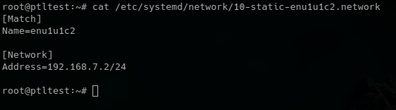

# How to set up Linux on the Ultra96v2

## Overview

1. Create hardware design for the Ultra96v2 in Vivado
2. Export hardware design .xsa file
3. Install PetaLinux 2025.1
4. Create a PetaLinux project for the Ultra96v2
5. Import the .xsa file into the PetaLinux project
6. Configure the PetaLinux project
7. Build and package the PetaLinux project
8. Partition an SD Card to boot PetaLinux on the Ultra96v2
9. Copy PetaLinux boot and root filesystem files to the SD Card
10. Connect to the Ultra96v2 via serial terminal
11. Boot the Ultra96v2 from the SD Card
12. Set up networking on the Ultra96v2 for ssh access
13. Install gcc-arm-11.2-2022.02-x86_64-aarch64-none-linux-gnu cross-compiler
14. Cross-compile test code and scp to the Ultra96v2
15. SSH into the Ultra96v2 and run code

## Detailed Steps
### 1. Create hardware design for the Ultra96v2 in Vivado
1. Open Vivado 24.02 (or whatever version you have installed that supports Ultra96v2)
2. Create a new project for Ultra96v2 (Zynq UltraScale+ MPSoC)
3. Select RTL project and don't include sources or extensibility for Vitis
4. In the board selection, choose Ultra96v2
5. Create block design and add Zynq UltraScale+ MPSoC IP
6. Run block automation for the Zynq MPSoC
7. Remove the maxihpm ports under PS-PL interface as demonstrated in this image:
   
8. Validate the design
9. Generate Outputs by right clicking on .bd design as shown:
   
9. Create HDL wrapper (let Vivado manage it) as shown:
   

### 2. Export hardware design .xsa file
1. Export the pre-synthesis hardware design to an .xsa file by going to File -> Export -> Export Hardware
2. Close Vivado

### 3. Install PetaLinux 2025.1
1. Download PetaLinux 2025.1 installer from Xilinx website [here](https://www.xilinx.com/support/download/index.html/content/xilinx/en/downloadNav/embedded-design-tools/2025-1.html)
2. Follow the PetaLinux Tools Documentation link next to the download link under "Documentation" to find a document titled "Installing the PetaLinux Tool". Click on that link to open the installation instructions.
3. Follow the installation instructions in that document to install PetaLinux 2025.1

### 4. Create a PetaLinux project for the Ultra96v2
1. Once PetaLinux is working, open a terminal and run the following command to create a new PetaLinux project with whatever name you want (replace `<PROJECT_NAME>` with your desired project name):
   ```bash
   petalinux-create project --template zynqMP --name <PROJECT_NAME>
   ```
This is also documented in the same "PetaLinux Tools Documentation: Reference Guide (UG1144)" as mentioned in step 3 above (for installing PetaLinux), under the section "Creating a PetaLinux Project"->"Creating an Empty Project".
### 5. Import the .xsa file into the PetaLinux project
1. Change directory into the newly created PetaLinux project:
    ```bash
    cd <PROJECT_NAME>
    ```
2. Import the .xsa file exported from Vivado into the PetaLinux project by running the following command (replace `<PATH_TO_XSA>` with the path to your .xsa file):
   ```bash
   petalinux-config --get-hw-description <PATH_TO_XSA>
   ```
This is also documented in the same "PetaLinux Tools Documentation: Reference Guide (UG1144)" as mentioned in step 3 above (for installing PetaLinux), under the section "Configuring and Building"->"Importing a Hardware Configuration".

### 6. Configure the PetaLinux project
It is recommended to follow the section "Configuring and Building" in the previously mentioned documentation as you complete these steps.

After running the command to import the .xsa file into the PetaLinux project, the PetaLinux configuration menu will open. You can navigate through the menu using the arrow keys, select options with the Enter key, and go back with the Esc key. There are 3 main configuration menus, and you are currently in one of them.

1. First, lets save and exit this menu by pressing the Esc key until you are prompted to save, then select "Yes" and press Enter. This saves the hardware configuration imported from the .xsa file without making any further changes.

Let's explain the 3 main configuration menus for PetaLinux projects before proceeding further:
- The first menu is the main configuration menu that you were just in. This menu contains project-wide settings (boot options, kernel selection, firmware components, image packaging, etc.). This menu can be accessed by running the command:
  ```bash
  petalinux-config
  ```
- The second menu is the kernel configuration menu. This menu is used to configure Linux kernel drivers and kernel build options. You only need to enter this menu if you specifically want to modify kernel features or enable additional drivers.This menu can be accessed by running the command:
  ```bash
  petalinux-config -c kernel
  ```
- The third menu is the root filesystem configuration menu. This menu controls which user-space packages and utilities are included in the final root filesystem. Use this only when you want to add applications, tools, or libraries to your image. This menu can be accessed by running the command:
  ```bash
  petalinux-config -c rootfs
  ```

#### ⚠️ Important Configuration Changes
2. Next, re-enter the main configuration menu by running:
   ```bash
   petalinux-config
   ```
   - In this menu, navigate to "Image Packaging Configuration" -> Root filesystem type, and set it to "ext4". Then press the Esc key to go back to the main menu.

   - Next, navigate to "Yocto Settings" -> "Yocto Machine Name", and set it to "ultra96v2-zynqmp". Then press the Esc key to go back to the main menu.

   - Next, navigate to "Subsystem Hardware Settings" -> "Serial Settings" and set PMUFW, FSBL, TF-A, and U-boot Serial stdin/stdout to "psu_uart_1" (the Ultra96v2's onboard UART). Then press the Esc key to go back to the main menu.

   - Next, navigate to "Subsystem Hardware Settings" -> "SD/SDIO Settings" and set Primary SD/SDIO to "manual". Then press the Esc key to go back to the main menu.

   - Finally, save and exit the main configuration menu by pressing the Esc key until you are prompted to save, then select "Yes" and press Enter.

3. Next, enter the root filesystem configuration menu by running:
   ```bash
   petalinux-config -c rootfs
   ```
   In this menu, navigate to "Filesystem Packages" -> "console" and enable as many packages as you find useful by selecting them and pressing the spacebar, such as:
   - `bash`
   - `sudo`
   - `vim`
   - `zip`
   - `unzip`
   - `grep`
   
   None of these packages are strictly necessary, but they make working in the terminal on the Ultra96v2 more convenient.

4. Now, still in the root filesystem configuration menu, navigate to "Image Features" and make sure the following features are enabled by selecting them and pressing the spacebar:
   - `empty-root-password`
   - `serial-autologin-root`

   
   
   These features allow you to log in as root without a password via the serial terminal, which is very useful for initial setup and testing.

   After enabling these features, press the Esc key to go back to the main menu, and save and exit.

5. IMPORTANT: Before building the project, paste the following string into the file "project-spec/meta-user/recipes-bsp/device-tree/files/system-user.dtsi" to make sure the root filesystem is correctly mounted as writable on the Ultra96v2:
    ```
    /include/ "system-conf.dtsi"
    / {
    };

    &sdhci0 {
        wp-gpios = <0>;
        disable-wp;
        no-1-8-v;
    };
    ```
Without this change, PetaLinux started having issues sometime around 2023 where the root filesystem would be mounted as read-only on the Ultra96v2, preventing any write operations, regardless of what PetaLinux configurations were set.

6. You're welcome to make any other desired changes to the PetaLinux project configuration before building, but nothing else is strictly necessary for a basic setup.

### 7. Build and package the PetaLinux project
1. To build the PetaLinux project, run the following command:
   ```bash
   petalinux-build
   ```
2. If you get this error during the build process:
   ```
   ERROR: User namespaces are not usable by BitBake, possibly due to AppArmor.
   ```
   Then run the following command to fix it:
   ```bash
   sudo sysctl -w kernel.apparmor_restrict_unprivileged_userns=0
   ```
   Then re-run the `petalinux-build` command.
2. After the build completes successfully, package the boot files for the Ultra96v2 by running the following command:
   ```bash
   petalinux-package --boot --fsbl images/linux/zynqmp_fsbl.elf --u-boot --force
   ```
3. The packaged boot files will be located in the `images/linux/` directory of your PetaLinux project.

### 8. Partition an SD Card to boot PetaLinux on the Ultra96v2
1. Insert an SD Card into your computer.
2. Use a partitioning tool (like `fdisk` or `gparted` on Linux, or Disk Management on Windows) to create two empty partitions on the SD Card (`gparted` is recommended):
   - A FAT32 partition of size 256MB (this will be the boot partition). Name this partition "BOOT"
   - An ext4 partition that uses the rest of the space on the SD Card (this will be the root filesystem partition). Name this partition "root"
   
   
3. Apply the changes to format the partitions and exit the partitioning tool.

### 9. Copy PetaLinux boot and root filesystem files to the SD Card
1. Open/mount both partitions so you can copy files to them.
2. cd into the `images/linux/` directory of your PetaLinux project.
3. Copy the following files from the `images/linux/` directory of your PetaLinux project to the FAT32 "BOOT" partition of the SD Card
   - `BOOT.BIN`
   - `image.ub`
   - `boot.scr`

   using this command (replace `<PATH_TO_SD_BOOT_PARTITION>` with the path to the mounted BOOT partition):
   ```bash
   cp BOOT.BIN image.ub boot.scr <PATH_TO_SD_BOOT_PARTITION>/
   ```
   For example, on Linux, if the BOOT partition is mounted at `/media/user/BOOT`, the command would be:
   ```bash
   cp BOOT.BIN image.ub boot.scr /media/user/BOOT/
   ```
4. Next, copy the contents of the `rootfs.tar.gz` file from the `images/linux/` directory of your PetaLinux project to the ext4 "root" partition of the SD Card by using the following command (replace `<PATH_TO_SD_ROOT_PARTITION>` with the path to the mounted root partition):
   ```bash
   sudo cp rootfs.tar.gz <PATH_TO_SD_ROOT_PARTITION>/
   ```
   For example, on Linux, if the root partition is mounted at `/media/user/root`, the command would be:
   ```bash
   sudo cp rootfs.tar.gz /media/user/root/
   ```
5. Next, extract the contents of the `rootfs.tar.gz` file into the root of the ext4 "root" partition by using the following commands (you can leave the tar file in the root partition after extraction):
   ```bash
   cd <PATH_TO_SD_ROOT_PARTITION>/
   sudo tar -xvzf rootfs.tar.gz
   ```
   For example, on Linux, if the root partition is mounted at `/media/user/root`, the commands would be:
   ```bash
   cd /media/user/root
   sudo tar -xvzf rootfs.tar.gz
   ```

6. Safely unmount/eject the SD Card on your computer. (You will have to wait for all write operations to complete to the root partition before you can physically remove the SD card, as it takes longer than it looks, so when unmounting/ejecting seems to hang, just give it some time.) After unmounting/ejecting completes, physically remove the SD Card from your computer.

### 10. Connect to the Ultra96v2 via serial terminal
1. Plug in a serial cable to the Ultra96v2 and connect it to your computer.
2. Connect your machine to the serial terminal using a program like screen or PuTTY. For example, on my Linux machine, I use the following command (replace `/dev/ttyUSB1` with the appropriate serial port for your machine):
   ```bash
   sudo screen /dev/ttyUSB1 115200
   ```

### 11. Boot the Ultra96v2 from the SD Card
1. Insert the SD Card into the Ultra96v2.
2. Put the Ultra96v2 into SD Boot mode by setting the tiny mode switches near the corner to fthe board (above the SD card port) to 1 OFF 2 ON (01).
3. Power on the Ultra96v2. You should see U-Boot messages in the serial terminal, followed by Linux boot messages. It should auto-login as root when the boot process completes.

### 12. Set up networking on the Ultra96v2 for ssh access
#### Setting a persistent static IP address for Ethernet on the Ultra96v2
1. Connect an Ethernet cable from the Ultra96v2 to your network.
2. On the Ultra96v2 terminal, run the following command:
   ```bash
   ip link
   ```
   You should see an interface named `enu1u1c2` after plugging in the Ethernet cable. The following image shows an example output of the `ip link` command before and after plugging in the Ethernet cable:
   
   
   
3. Next, create a new network configuration file for the Ethernet interface by running the following command:
   ```bash
   vim /etc/systemd/network/10-static-enu1u1c2.network
   ```
4. In the vim editor, press the `i` key to enter insert mode, then paste the following configuration into the file:
   ```
   [Match]
   Name=enu1u1c2

   [Network]
   Address=192.168.7.2/24
   ```
5. Press the `Esc` key to exit insert mode, then type `:wq` and press Enter to save and exit vim. The following image shows what the file should look like afterwards:



6. Next, restart the systemd-networkd service to apply the new network configuration by running the following command:
   ```bash
   systemctl restart systemd-networkd
   ```
   Then check that the new IP address has been assigned by running:
   ```bash
   ip addr show enu1u1c2
   ```
   You should see the IP address `192.168.7.2/24` assigned to the `enu1u1c2` interface.
#### Permit ssh access to the Ultra96v2 without a password (necessary)
1. On the Ultra96v2 terminal, run the following command to edit the sshd_config file:
   ```bash
   vi /etc/ssh/sshd_config
   ```
2. In the vim editor, press the `i` key to enter insert mode, under the line that says `# Authentication:`, paste the following lines to overwrite the default settings shown by the `#` comments:
   ```
   PermitRootLogin yes
   PasswordAuthentication yes
   PermitEmptyPasswords yes
   ```
3. Press the `Esc` key to exit insert mode, then type `:wq` and press Enter to save and exit vim.
4. Next, restart the sshd service to apply the new ssh configuration by running the following command:
   ```bash
   systemctl restart sshd.socket
   ```
5. Now, from your host machine, create an ssh configuration for the Ultra96v2 by adding the following lines to your `~/.ssh/config` file (create the file if it doesn't exist):
   ```
   Host u96
    HostName 192.168.7.2
    User root
    StrictHostKeyChecking no
    UserKnownHostsFile /dev/null
    LogLevel ERROR
   ```
   This allows you to ssh into the Ultra96v2 using the command `ssh u96` without being prompted to accept the host key each time. By not saving it as a known_host, you use this same configuration on another Linux setup on the Ultra96v2 without it freaking out about identity changes when you ssh between them.
6. Save and exit the file.
7. Now, from your host machine, you should be able to ssh into the Ultra96v2 without a password by running:
   ```bash
   ssh u96
   ```

### 13. Install gcc-arm-11.2-2022.02-x86_64-aarch64-none-linux-gnu cross-compiler
1. On your host machine, navigate to the /tools directory of this DTRA-URA repository.
2. Run the following command to extract the cross-compiler:
   ```bash
   make install_u96_linux_compiler
   ```

### 14. Cross-compile test code and scp to the Ultra96v2
For this step, I will assume you have a simple "Hello World" C program saved as `hello.c` in your current directory on your host machine.
1. On your host machine, compile the `hello.c` program using the cross-compiler by running the following command (replace `<PATH_TO_DTRA_URA>` with the path to your DTRA-URA repository):
   ```bash
   <PATH_TO_DTRA_URA>/tools/gcc-arm-11.2-2022.02-x86_64-aarch64-none-linux-gnu/bin/aarch64-none-linux-gnu-gcc -o hello hello.c
   ```
2. Once the program is compiled, you can copy it to the Ultra96v2 home directory using `scp`:
   ```bash
   scp hello u96:~/
   ```

### 15. SSH into the Ultra96v2 and run code
1. SSH into the Ultra96v2 from your host machine by running:
   ```bash
   ssh u96
   ```
2. Once logged in, you should see the `hello` program in your home directory. Run it by executing:
   ```bash
   ./hello
   ```
3. You should see the output of the program, which should be "Hello, World!"
